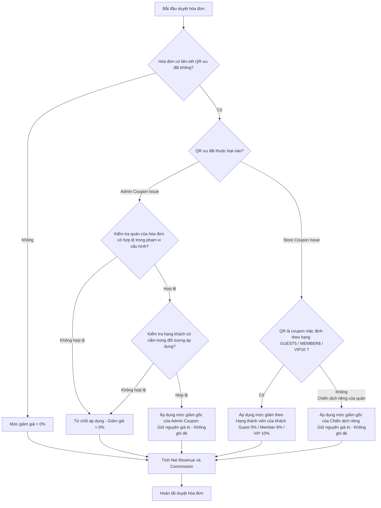

# Tài liệu Nghiệp vụ: Luồng Đặt bàn & Áp dụng Ưu đãi (Coupons & Bookings)

Tài liệu này tổng hợp và làm rõ toàn bộ quy định nghiệp vụ đối với các luồng đặt bàn, phát hành mã QR ưu đãi, kiểm tra phạm vi áp dụng, và tính toán giảm giá khi duyệt hóa đơn (Bill) trong hệ thống NightLife-VN.

---

## 1. Tổng quan các Luồng Nghiệp vụ Ưu đãi

Hệ thống hỗ trợ 3 luồng ưu đãi/giảm giá riêng biệt như sau:

| Tiêu chí | Luồng 1: Ưu đãi mặc định theo Hạng | Luồng 2: Chiến dịch riêng của Quán (Campaign) | Luồng 3: Mã ưu đãi do Admin phát hành (Admin Coupon) |
| :--- | :--- | :--- | :--- |
| **Nơi cấu hình** | Tự động áp dụng theo chính sách hệ thống (mã coupon mặc định của quán). | Quản trị nội dung CMS (`/admin/content` -> Tab *Campaign & Discount*). | Quản lý Coupon & QR (`/admin/coupons` -> Nút *Tạo coupon mới*). |
| **Cách kích hoạt** | Khách click **"Đặt chỗ ngay"** trực tiếp trên trang chi tiết quán (không chọn coupon riêng). | Khách click chọn **Chiến dịch cụ thể** ở Trang chủ (mục *Coupon Hot*) hoặc Trang chi tiết quán. | Khách **quét mã QR chung** của chiến dịch hoặc bấm **"Lấy mã"** trên ứng dụng để nhận QR cá nhân. |
| **Mức giảm giá** | Theo hạng khách hàng tại thời điểm đặt bàn:  - Guest: **5%**  - Member: **8%**  - VIP: **10%** | Giữ nguyên cấu hình gốc của chiến dịch (Ví dụ: **15%**, **20%** hoặc giảm cố định **200K**). | Giữ nguyên cấu hình gốc của chiến dịch (Ví dụ: **10%** toàn hệ thống hoặc chọn quán). |
| **Đối tượng áp dụng** | Tự động phân loại theo tài khoản khách đặt. | Áp dụng cho mọi đối tượng khách hàng nhìn thấy chiến dịch. | Theo cấu hình của Admin lúc tạo (Tích chọn: Guest, Member, VIP). |
| **Phạm vi áp dụng** | Chỉ áp dụng tại chính quán được đặt chỗ. | Chỉ áp dụng tại quán sở hữu chiến dịch đó. | - **Toàn hệ thống**: Áp dụng tại mọi quán.  - **Chọn quán**: Chỉ áp dụng tại các quán được tích chọn. |

---

## 2. Chi tiết Nghiệp vụ từng Luồng & Lệch luồng (Gap Analysis)

### LUỒNG 1: Đặt bàn Thông thường & Ưu đãi theo Hạng thành viên

#### A. Nghiệp vụ theo BA
* Mỗi khi khách hàng tạo đặt bàn thông thường (không chọn coupon riêng), hệ thống bắt buộc phải tự động cấp một mã QR ưu đãi đi kèm booking.
* Mức giảm giá mặc định được snapshot cố định tại thời điểm tạo booking: **Guest (5%)**, **Member (8%)**, **VIP (10%)** (không đổi kể cả khi hạng tài khoản của khách thay đổi sau đó).
* Mã QR này dùng để quét check-in tại quán và tự động áp dụng mức giảm 5%/8%/10% khi Admin duyệt hóa đơn (Bill).
* Booking phải xuất hiện ở tab **"Đang giữ chỗ"** trong trang `/admin/coupons`.

#### B. Thực trạng triển khai trong Code & Điểm lệch (Gap)
* **Lệch luồng:** Nếu khách không chọn coupon, API tạo booking lưu xuống cơ sở dữ liệu với `coupon_issue_id = NULL` (không sinh bản ghi trong bảng `coupon_issues`).
* **Hậu quả:** 
  1. Booking hoàn toàn không hiển thị ở tab "Đang giữ chỗ" của trang quản trị `/admin/coupons`.
  2. Khi duyệt hóa đơn, do không tìm thấy thông tin coupon liên kết, hệ thống tính mức giảm giá mặc định là **0%** thay vì 5%/8%/10% theo hạng thành viên.
* **Nguyên nhân kỹ thuật:** Hệ thống đang giới hạn các coupon mặc định (`GUEST5`, `MEMBER8`, `VIP10`) theo từng quán cụ thể trong file seed và không tự động tạo chúng cho các quán mới (như Crimson Bar), đồng thời backend chưa có logic tự động tìm/gán coupon mặc định khi tham số `couponId` truyền lên trống.

---

### LUỒNG 2: Chiến dịch riêng của Quán (Custom Store Campaign)

#### A. Nghiệp vụ theo BA
* Quán có thể tạo chiến dịch khuyến mãi riêng thông qua trang CMS quản trị nội dung của Admin (ví dụ: Giảm **20%** hoặc giảm cố định **200K** cho quán *Opera Spa Hải Phòng*).
* Chiến dịch này hiển thị ở trang chủ (mục *Coupon Hot*) hoặc trang chi tiết của quán.
* Khi khách hàng click chọn chiến dịch này để đặt bàn, hệ thống phải **giữ nguyên giá trị ưu đãi gốc của chiến dịch** (20% hoặc 200k) và lưu vào snapshot ưu đãi của booking.
* **Tuyệt đối không được lấy mức giảm theo hạng thành viên (5%/8%/10%) để ghi đè lên.**

#### B. Thực trạng triển khai trong Code & Điểm lệch (Gap)
* **Lệch luồng:** Hàm `buildCouponDiscountRuleSnapshot` ở backend đang tự động ghi đè thuộc tính `discountPercent = COUPON_DISCOUNT_PERCENT_BY_USER_TYPE[userType]` lên tất cả các coupon được phát hành dưới dạng phần trăm.
* **Hậu quả:** Khách vãng lai (Guest) đặt bàn qua coupon 20% của quán sẽ bị hệ thống tự động ghi đè hạ mức giảm xuống còn **5%**, và Member chỉ được giảm **8%**. 
* **Nguyên nhân kỹ thuật:** Thiếu logic kiểm tra loại coupon trong hàm xử lý snapshot backend. Hàm đang coi mọi coupon issue phát hành đều phải tuân theo hạn mức giảm của hạng thành viên.

---

### LUỒNG 3: Mã ưu đãi do Admin phát hành độc lập (Admin Global Coupon)

#### A. Nghiệp vụ theo BA
* Khác với hai luồng trên (phải thông qua đặt bàn mới sinh QR), ở luồng này Admin tạo chiến dịch từ trang `/admin/coupons` và hệ thống sinh ra **1 mã QR chung duy nhất cho chiến dịch** (Global QR).
* Khách hàng quét mã QR chung này hoặc bấm "Lấy mã" trong ứng dụng để nhận một mã QR ưu đãi cá nhân (`AdminCouponIssue`) lưu vào ví.
* **Cấu hình Đối tượng áp dụng (Audiences):** Admin có thể tích chọn các hạng khách hàng được phép nhận mã (Guest, Member, VIP). Nếu chọn Guest, khách vãng lai chưa đăng nhập vẫn quét nhận mã hợp lệ.
* **Cấu hình Phạm vi áp dụng (Scope):**
  * **Toàn hệ thống (Entire System):** Khách sở hữu mã QR cá nhân này có thể sử dụng để áp dụng giảm giá khi đặt bàn / thanh toán tại **bất kỳ quán nào trong hệ thống**.
  * **Chọn quán (Specific Stores):** Mã QR cá nhân chỉ có hiệu lực tại đúng (các) quán được Admin chỉ định. Hệ thống sẽ từ chối áp dụng giảm giá nếu khách quét tại quán khác ngoài danh sách.

#### B. Thực trạng triển khai trong Code & Điểm lệch (Gap)
* **Lệch luồng:** Bảng cấu trúc cơ sở dữ liệu đã định nghĩa thực thể `AdminCoupon` và `AdminCouponIssue` riêng biệt. Tuy nhiên, logic backend liên quan đến việc:
  1. Quét mã nhận coupon từ QR chung của chiến dịch.
  2. Áp dụng mã `AdminCouponIssue` khi khách đặt chỗ hoặc quét check-in tại quán.
  3. Kiểm tra tính hợp lệ của phạm vi (Toàn hệ thống / Chọn quán) và tính toán giảm giá hóa đơn khi Admin duyệt bill.
  Chưa được kết nối đồng bộ và triển khai đầy đủ trong luồng xử lý booking/billing của `nightlife-data.service.ts`.

---

## 3. Sơ đồ Logic xử lý Giảm giá khi duyệt Hóa đơn (Bill Approval)

Dưới đây là luồng xử lý tính toán giảm giá đúng chuẩn cần triển khai ở backend khi Admin duyệt hóa đơn:

---

## 4. Kế hoạch Hành động để Khắc phục các Gaps Kỹ thuật

1. **Khắc phục Luồng 1 (Ưu đãi mặc định):**
   * Sửa hàm [createBookingRecord](file:///d:/laragon/www/NightLife-VN/backend/src/nightlife-data/nightlife-data.service.ts#L10104-L10183) ở backend: Nếu không truyền `couponId`, tự động tìm kiếm/truy vấn coupon mặc định của quán đó ứng với hạng thành viên của khách (Guest, Member, VIP).
   * Tạo cơ chế tự động tạo 3 coupon mặc định cho quán khi quán mới được onboard/tạo mới trong hệ thống.
   * Tiến hành sinh `CouponIssue` và liên kết vào booking thay vì để `NULL`.

2. **Khắc phục Luồng 2 (Chiến dịch riêng của Quán):**
   * Chỉnh sửa hàm [buildCouponDiscountRuleSnapshot](file:///d:/laragon/www/NightLife-VN/backend/src/nightlife-data/nightlife-data.service.ts#L15809-L15832): Kiểm tra mã coupon (`coupon.code`). Nếu là coupon thuộc chiến dịch riêng (không phải mã mặc định `GUEST5`, `MEMBER8`, `VIP10`), **giữ nguyên cấu hình gốc** về `discountType` và `discountValue`, loại bỏ logic ghi đè theo hạng.

3. **Khắc phục Luồng 3 (Admin Global Coupon):**
   * Triển khai API cho phép khách hàng quét mã QR chung hoặc click "Lấy mã" để tạo bản ghi `AdminCouponIssue` liên kết với tài khoản/guest của họ.
   * Cập nhật hàm [resolveBookingCouponLink](file:///d:/laragon/www/NightLife-VN/backend/src/nightlife-data/nightlife-data.service.ts#L9266-L9382) và [resolveBillApprovalDiscount](file:///d:/laragon/www/NightLife-VN/backend/src/nightlife-data/nightlife-data.service.ts#L8296-L8380) để hỗ trợ tìm kiếm, xác thực phạm vi (Toàn hệ thống / Chọn quán) và tính toán giảm giá dựa trên mã `AdminCouponIssue`.
