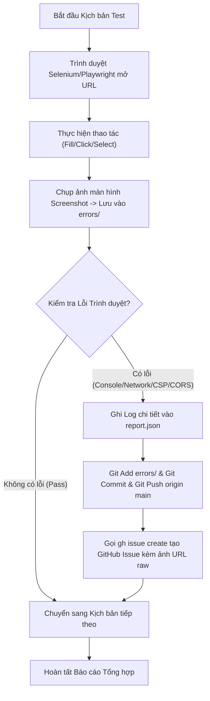

[DRAFT — Requires Human Review]
# Kế Hoạch Chi Tiết & Báo Cáo Thực Thi Kiểm Thử Tự Động E2E Hệ Thống NightLife-VN | Type: Test Execution Specification | Date: 2026-08-01

> **Trạng thái tài liệu**: [DRAFT — Requires Human Review]  
> **Tài liệu đối chiếu tham chiếu**: [D:\laragon\www\NightLife-VN\docs\doi-chieu-code-vs-tai-lieu-BA-v3.3.md](file:///D:/laragon/www/NightLife-VN/docs/doi-chieu-code-vs-tai-lieu-BA-v3.3.md)  
> **Môi trường thực thi**: Website Live `https://demonightlight.test9.io.vn/` & Auth Subdomain `https://auth.demonightlight.test9.io.vn/`  
> **Bộ công cụ thực thi**: Python Selenium + Node Playwright / Puppeteer, GitHub CLI (`gh`), Ripgrep & Automated Console/Network Logger  

---

## 1. MỤC TIÊU VÀ PHẠM VI KIỂM THỬ (TEST OBJECTIVES & SCOPE)

### 1.1 Mục tiêu chính
- Tự động hóa kiểm thử End-to-End (E2E) 100% các luồng nghiệp vụ cốt lõi từ giao diện Người dùng (Guest/Member), Đối tác (Partner/Staff) đến Quản trị viên (Admin/Operator/Super Admin).
- Chụp ảnh màn hình (Screenshot) minh chứng ở từng bước thao tác và lưu giữ tại thư mục `errors/` (hoặc `test_results/`).
- Bắt toàn bộ lỗi Console Log (Errors/Warnings), Lỗi Mạng (Network HTTP status 4xx/5xx, CORS, CSP, Preflight) trên trình duyệt.
- Tự động đối chiếu hành vi thực tế với đặc tả tại tài liệu BA v3.3 (`doi-chieu-code-vs-tai-lieu-BA-v3.3.md`).
- Tự động đẩy mã commit chứa ảnh chụp và tạo GitHub Issues kèm đường dẫn hình ảnh trên GitHub Repository `Lam-Phong-Tech/NightLife-VN`.

---

## 2. NGUYÊN TẮC PHÂN LOẠI DỮ LIỆU IN TÀI LIỆU (DATA CLASSIFICATION RULE)

Theo quy định `create-doc`, toàn bộ nội dung được phân loại minh bạch như sau:
- `[FACT: Sourced]` – Dữ liệu thực tế được trích xuất từ codebase NestJS/Next.js hoặc tài liệu BA v3.3.
- `[INTERPRETATION]` – Phân tích, suy luận kỹ thuật của Agent dựa trên hiện trạng hệ thống.
- `[ASSUMPTION]` – Giả định về dữ liệu đầu vào hoặc tài khoản thử nghiệm trên môi trường Staging/Live.
- `[GAP]` – Điểm chưa rõ ràng hoặc thiếu thông tin cần người dùng/BA xác nhận.

---

## 3. KỊCH BẢN THỰC THI CHI TIẾT THEO PHÂN HỆ (DETAILED TEST SUITES)

### PHÂN HỆ 1: ĐĂNG KÝ & ĐĂNG NHẬP THÀNH VIÊN (MEMBER AUTH FLOW)

#### Kịch bản 1.1: Đăng ký tài khoản Member qua OTP Email 8 số
- **Các bước thực thi**:
  1. Điều hướng tới `https://auth.demonightlight.test9.io.vn/dang-ky`.
  2. Tự động điền Họ tên (2-80 ký tự), Email nhận OTP.
  3. Bấm "Gửi mã OTP".
  4. `[FACT: Sourced]` *Quy tắc backend*: OTP là 8 chữ số, hiệu lực 15 phút, cooldown giữa 2 lần gửi = 60s, nhập sai > 5 lần bị khóa email đăng ký (`auth.service.ts:167-221`).
  5. Nhập OTP và Mật khẩu, bấm "Đăng ký thành viên".
- **Tiêu chí đạt (Pass Criteria)**:
  - Tài khoản được tạo với `UserTier = MEMBER`, `UserStatus = ACTIVE`.
  - Tự động chuyển hướng về `/tai-khoan` hoặc màn hình Đăng nhập.
- **Ảnh chụp màn hình**: `auth_register_step1.png`, `auth_otp_step2.png`, `auth_register_success.png`.

#### Kịch bản 1.2: Đăng nhập & Kiểm tra Cookie / Token phiên làm việc
- **Các bước thực thi**:
  1. Truy cập `https://auth.demonightlight.test9.io.vn/dang-nhap?portal=member&redirect=%2Ftai-khoan`.
  2. Nhập Email/SĐT và Mật khẩu, bấm "Đăng nhập".
  3. Inspect Cookies & LocalStorage trên trình duyệt.
  4. Truy cập các trang nội bộ khu Member: `/tai-khoan`, `/bao-mat-tai-khoan`.
- **Tiêu chí đạt**:
  - `[FACT: Sourced]` Token JWT được lưu an toàn trong Cookie `SameSite=Lax/Strict`.
  - Màn hình `/bao-mat-tai-khoan` hiển thị đúng thông tin: Họ tên, Email, SĐT, UserTier (`MEMBER/PREMIUM/VIP`), UserRole.
  - Cho phép cập nhật Họ tên (2-80 ký tự) và SĐT (8-15 số).
- **Ảnh chụp màn hình**: `auth_login_page.png`, `member_account_dashboard.png`, `member_security_profile.png`.

---

### PHÂN HỆ 2: ĐẶT BÀN & CHỌN CAST (BOOKING & CAST FLOW)

#### Kịch bản 2.1: Duyệt danh sách Quán & Lọc theo Thành phố / Khu vực
- **Các bước thực thi**:
  1. Truy cập `https://demonightlight.test9.io.vn/`.
  2. Kiểm tra bộ lọc Thành phố: `HN`, `HCM`, `DN`, `HP` và 30 tỉnh thành toàn quốc (`[FACT: Sourced]` `vietnam-admin-units.ts`).
  3. Lọc theo loại hình quán (Bar, Pub, Lounge, Karaoke, Club...).
  4. Bấm vào chi tiết 1 quán bất kỳ (`/stores/[slug]`).
- **Tiêu chí đạt**:
  - `[FACT: Sourced]` Thẻ quán hiển thị đúng Badge ưu đãi (`hasActiveCoupon`), Menu giá dạng ký hiệu `$-$$$$` và "Giá từ".
  - Trang chi tiết hiển thị tự động 4 quán liên quan và danh sách Cast active thuộc quán.
- **Ảnh chụp màn hình**: `booking_store_list.png`, `booking_store_detail.png`.

#### Kịch bản 2.2: Tạo đơn đặt chỗ & Đặt Cast đi kèm
- **Các bước thực thi**:
  1. Tại trang chi tiết quán, bấm "Đặt chỗ ngay" (`/dat-cho?storeId=...`).
  2. Chọn Ngày đến (trong cửa sổ 14 ngày), Khung giờ đến (sinh tự động từ giờ mở cửa quán).
  3. Nhập Số lượng khách: Thử nhập 1, 20, 50 người (`[FACT: Sourced]` backend hỗ trợ partySize 1-50, `@Min(1) @Max(50)` tại `create-booking.dto.ts:165`).
  4. Chọn Cast đồng hành (nếu có).
  5. Áp mã Coupon/Mã ưu đãi từ Ví ưu đãi.
  6. Điền thông tin liên hệ (Họ tên, SĐT, Ghi chú), bấm "Xác nhận đặt bàn".
- **Tiêu chí đạt**:
  - Tự động chuyển tới trang `/xac-nhan` với Mã booking (15 ký tự) và Mã QR code hiển thị rõ ràng.
  - Cho phép tải ảnh QR Code về máy (`download_qr`).
  - Gửi Email xác nhận kèm đính kèm QR Code cho khách.
- **Ảnh chụp màn hình**: `booking_form_fill.png`, `booking_cast_select.png`, `booking_confirmation_qr.png`.

#### Kịch bản 2.3: Đổi lịch (Reschedule Self-Service) & Hủy Booking
- **Các bước thực thi**:
  1. Điều hướng tới `/lich-su-dat-cho`.
  2. Chọn booking trạng thái `REQUESTED` hoặc `CONFIRMED`.
  3. **Thử luồng Đổi lịch (Reschedule)**: Chọn ngày/giờ mới cách mốc hiện tại >= `bookingCancelCutoffMinutes` của quán (30/60/120 phút), điền lý do, bấm gửi.
  4. **Thử luồng Hủy đặt chỗ (Cancel)**: Bấm "Hủy booking", nhập lý do hủy.
- **Tiêu chí đạt**:
  - `[FACT: Sourced]` Cập nhật trạng thái booking trực tiếp nếu tự đổi giờ hợp lệ (`nightlife-data.service.ts:12820`), hoặc tạo `BookingChangeRequest` để Admin duyệt.
  - Hủy booking đổi trạng thái sang `CANCELLED`.
- **Ảnh chụp màn hình**: `booking_history_list.png`, `booking_reschedule_modal.png`, `booking_cancelled_state.png`.

---

### PHÂN HỆ 3: GIAO DIỆN ĐỐI TÁC (PARTNER PORTAL)

#### Kịch bản 3.1: Đăng nhập Partner & Quản lý Đơn đặt bàn
- **Các bước thực thi**:
  1. Truy cập `https://auth.demonightlight.test9.io.vn/dang-nhap?portal=partner`.
  2. Đăng nhập tài khoản Partner/Staff được gán quyền cho quán.
  3. Xem danh sách booking của quán (trạng thái `REQUESTED`, `CONFIRMED`, `CHECKED_IN`, `COMPLETED`).
- **Tiêu chí đạt**:
  - Hiển thị đúng phạm vi dữ liệu thuộc quán mình (`StorePermission`).
- **Ảnh chụp màn hình**: `partner_login.png`, `partner_booking_list.png`.

#### Kịch bản 3.2: Quét / Xác nhận Mã QR Check-in của Khách
- **Các bước thực thi**:
  1. Partner mở giao diện Quét QR Code (`/partner/scan` hoặc nhập token QR).
  2. Thực hiện hành động Quét (Scan) -> Kiểm tra thông tin hiển thị.
  3. Thực hiện Xác nhận Check-in (Confirm Check-in).
- **Tiêu chí đạt**:
  - `[FACT: Sourced]` Đơn booking chuyển từ `CONFIRMED` -> `CHECKED_IN` (`nightlife-data.service.ts:5274`).
  - Mã Coupon Issue chuyển sang `USED`.
  - Ghi Audit Log `BOOKING_QR_SCANNED` và `COUPON_ISSUE_USED`.
- **Ảnh chụp màn hình**: `partner_qr_scan.png`, `partner_checkin_confirmed.png`.

#### Kịch bản 3.3: Nộp Hóa đơn / Bill dịch vụ & Đơn nháp Cast
- **Các bước thực thi**:
  1. Partner chọn booking đã check-in, bấm "Nộp hóa đơn".
  2. Nhập subtotal bill gốc, giảm giá, số tiền thanh toán, tải ảnh/PDF hóa đơn chứng từ (tối đa 25MB).
  3. **Tạo bản nháp Cast mới**: Vào mục Quản lý Cast -> "Thêm Cast mới", nhập tên, bio, giá giờ (`hourlyRateVnd`), tải ảnh avatar/gallery -> Bấm "Gửi duyệt".
- **Tiêu chí đạt**:
  - Bill được tạo ở trạng thái `SUBMITTED` (hoặc `PENDING_PM_BA` nếu có cờ nhạy cảm).
  - Cast mới tạo bản sao ở trạng thái `PENDING_REVIEW` gắn với cast gốc (`nightlife-data.service.ts:22530`).
- **Ảnh chụp màn hình**: `partner_bill_submit.png`, `partner_cast_draft_submit.png`.

---

### PHÂN HỆ 4: GIAO DIỆN QUẢN TRỊ VIÊN (ADMIN CMS /ADMIN)

#### Kịch bản 4.1: Đăng nhập Admin & Quản lý Quán (Store CRUD)
- **Các bước thực thi**:
  1. Truy cập `https://auth.demonightlight.test9.io.vn/admin/dang-nhap`.
  2. Đăng nhập tài khoản `ADMIN` / `SUPER_ADMIN`.
  3. Vào Quản lý Quán -> Bấm "Thêm Quán mới".
  4. Nhập Tên quán, Phường/Quận, Thành phố, Tọa độ Lat/Lng Google Places, Giờ mở cửa từng thứ trong tuần, Menu giá structural (Nhóm món, tên món, giá, tier `$-$$$$`), Tải ảnh đại diện/gallery.
  5. Cấu hình chính sách hủy `bookingCancelCutoffMinutes` (30/60/120 phút).
- **Tiêu chí đạt**:
  - Quán tạo mới ở trạng thái `ACTIVE`, hiển thị đúng trên trang public.
  - Ghi Audit Log hành động tạo/sửa quán.
- **Ảnh chụp màn hình**: `admin_login.png`, `admin_store_create_form.png`, `admin_store_detail.png`.

#### Kịch bản 4.2: Quản lý & Duyệt Cast (Merge Draft -> Cast gốc)
- **Các bước thực thi**:
  1. Vào Admin CMS -> Mục "Duyệt Cast" (`/admin/casts/pending`).
  2. Xem danh sách Cast bản nháp `PENDING_REVIEW` do Partner nộp.
  3. Xem so sánh thông tin giữa bản nháp và Cast gốc.
  4. Bấm "Chấp nhận duyệt" (Approve).
- **Tiêu chí đạt**:
  - `[FACT: Sourced]` Hệ thống merge toàn bộ thông tin + media bản nháp vào Cast gốc trong 1 transaction, ẩn media cũ, xóa mềm bản nháp (`nightlife-data.service.ts:22530`).
- **Ảnh chụp màn hình**: `admin_cast_pending_list.png`, `admin_cast_merge_approval.png`.

#### Kịch bản 4.3: Duyệt Bill, Xử lý Hoa hồng, Void Bill & Đảo điểm Tự động
- **Các bước thực thi**:
  1. Vào Admin CMS -> Mục Duyệt Bill (`/admin/bills`).
  2. Xem danh sách bill `SUBMITTED` (sắp xếp FIFO cũ nhất trước).
  3. **Thử duyệt Bill**: Bấm Duyệt bill -> Kiểm tra tính điểm Loyalty (`100.000đ = 1 điểm` làm tròn xuống floor), snapshot rule version `v2.2`.
  4. **Thử Void / Hoàn Bill**: Chọn 1 bill `VERIFIED`/`PAID`, bấm "Void Bill", nhập lý do.
- **Tiêu chí đạt**:
  - `[FACT: Sourced]` Bill chuyển `VOIDED`, tự động tạo bản ghi sổ điểm `REVERSE` trừ đúng số điểm đã cộng, lưu `refundReference` (`nightlife-data.service.ts:9062`).
  - Ghi Audit Log `bill.review.approve` và `bill.review.void`.
- **Ảnh chụp màn hình**: `admin_bill_review_page.png`, `admin_bill_void_reversed.png`.

#### Kịch bản 4.4: Quản lý Campaign, Ghim Ranking Top 1-5 & Xuất Báo cáo Excel
- **Các bước thực thi**:
  1. Vào CMS -> Quản lý Ranking (`/admin/rankings`).
  2. Tạo thiết lập xếp hạng `RankingConfig`: Chọn loại (STORE/CAST), Thành phố, Category, vị trí ghim `pinRank` (1-5), `manualScore`, cờ `sponsored`.
  3. Vào CMS -> Quản lý Campaign: Tạo campaign giảm % / tiền cố định.
  4. Vào Dashboard -> Bấm "Xuất báo cáo Excel".
- **Tiêu chí đạt**:
  - `[FACT: Sourced]` Kiểm tra không trùng pinRank trong cùng nhóm 5 item (`nightlife-data.service.ts:16206`).
  - Ghi Audit Log `ranking.config.create`.
  - Tải về file Excel 4 sheet đầy đủ: Tổng quan, Booking, Hóa đơn, Theo quán (`admin-dashboard-report.ts`).
- **Ảnh chụp màn hình**: `admin_ranking_config.png`, `admin_excel_export_download.png`.

---

## 4. QUY TRÌNH GHI HÌNH, LOGGING & TỰ ĐỘNG NỘP GITHUB ISSUES



### Các quy định kỹ thuật tự động hóa:
1. **Lưu trữ ảnh**: Toàn bộ ảnh chụp được lưu tên theo format: `{phanhang}_{kichban}_{tenthaotac}.png` tại `D:\laragon\www\NightLife-VN\errors\`.
2. **Commit & Push**: Sau khi chụp ảnh, tự động thực hiện:
   ```bash
   git add errors/
   git commit -m "docs: add E2E test execution screenshots and failure report"
   git push origin main
   ```
3. **Tạo GitHub Issue tự động**: Sử dụng lệnh `gh issue create` gửi tiêu đề, mô tả lỗi, log bằng chứng và Markdown nhúng ảnh raw từ repo: ``.

---

## 5. CÁC ĐIỂM CẦN LƯU Ý & CẢNH BÁO (ASSUMPTIONS, GAPS & RISKS)

- `[FACT: Sourced]` Tài khoản Admin chính thức đã được xác nhận:  
  - **Email**: `admin@nightlife.vn`  
  - **Mật khẩu**: `Str0ngPass!`  
- `[FACT: Sourced]` Tài khoản Partner: Tạo mới tự do trên môi trường test/live trong quá trình chạy kịch bản.  
- `[FACT: Sourced]` *Lưu ý về Hoa hồng*: Hệ thống backend hiện đã TẮT hoàn toàn tính năng tính hoa hồng (`COMMISSION_DISABLED` luôn = 0) theo quyết định sản phẩm (`nightlife-data.service.ts:10393`), nên luồng duyệt bill mới không rơi vào trạng thái `PENDING_PM_BA` do hoa hồng âm.  
- `[FACT: Sourced]` *Lưu ý về phân quyền API*: Các endpoint `/admin/campaigns`, `/admin/categories`, `/admin/tours` hiện chưa gắn `AdminGuard` (`campaigns.controller.ts:52`), cần chú ý khi gọi API trực tiếp.

---

## 6. DANH SÁCH HỒ SƠ VÀ MA TRẬN KẾT QUẢ MONG ĐỢI (TEST MATRIX)

| ID | Phân hệ | Kịch bản kiểm thử | Trạng thái mong đợi | Đường dẫn ảnh minh chứng |
|---|---|---|---|---|
| TC-AUTH-001 | Thành viên | Đăng ký tài khoản OTP Email 8 số | `PASS` | `errors/auth_register.png` |
| TC-AUTH-002 | Thành viên | Đăng nhập & Kiểm tra Cookie JWT, Hồ sơ | `PASS` | `errors/auth_profile.png` |
| TC-BOOK-001 | Đặt chỗ | Tìm kiếm quán & Lọc 34 tỉnh thành | `PASS` | `errors/booking_search.png` |
| TC-BOOK-002 | Đặt chỗ | Tạo booking 1-50 khách & chọn Cast | `PASS` | `errors/booking_qr.png` |
| TC-BOOK-003 | Đặt chỗ | Tự đổi lịch (Reschedule) & Hủy booking | `PASS` | `errors/booking_reschedule.png` |
| TC-PART-001 | Đối tác | Xác nhận QR Check-in chuyển `CHECKED_IN` | `PASS` | `errors/partner_checkin.png` |
| TC-PART-002 | Đối tác | Nộp hóa đơn chứng từ bill & Đơn nháp Cast | `PASS` | `errors/partner_bill_cast.png` |
| TC-ADM-001 | Admin CMS | Tạo Quán mới kèm menu structural `$-$$$$` | `PASS` | `errors/admin_store_crud.png` |
| TC-ADM-002 | Admin CMS | Duyệt Cast (Merge Draft -> Cast gốc) | `PASS` | `errors/admin_cast_merge.png` |
| TC-ADM-003 | Admin CMS | Duyệt Bill, Void bill & Đảo điểm sổ cái | `PASS` | `errors/admin_bill_void.png` |
| TC-ADM-004 | Admin CMS | Ghim Ranking Top 1-5 & Xuất Excel 4 sheet | `PASS` | `errors/admin_excel.png` |
